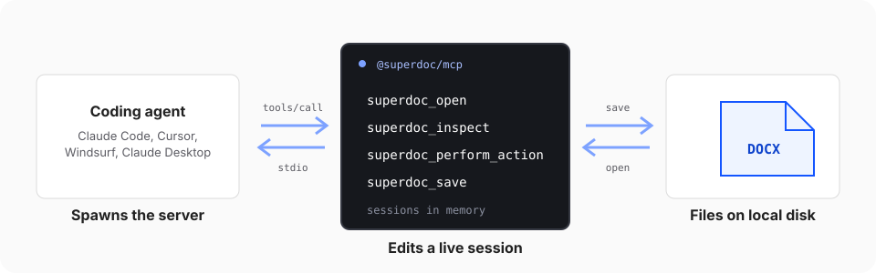

Use the MCP server when the agent already exists and you want it to work on DOCX files. It gives any [Model Context Protocol](https://modelcontextprotocol.io) client the same document engine the Editor and SDK use, without writing an agent loop of your own.

The client spawns the server as a local subprocess and talks to it over stdio. The server keeps each open document as an in-memory session, and writes your edited DOCX when the agent saves.



## 1. Register the server

The package is `@superdoc/mcp`. It needs Node.js 20 or newer on the machine that runs the client. Use the configuration below for this walkthrough.

**Claude Code**

```bash
claude mcp add superdoc -e MCP_PRESET=core -- npx @superdoc/mcp
```

**Claude Desktop**

Add the server to `claude_desktop_config.json`. On macOS the file is at `~/Library/Application Support/Claude/claude_desktop_config.json`.

```json
{
  "mcpServers": {
    "superdoc": {
      "command": "npx",
      "args": ["@superdoc/mcp"],
      "env": { "MCP_PRESET": "core" }
    }
  }
}
```

**Cursor**

Add the same entry to `~/.cursor/mcp.json`.

**Windsurf**

Add the same entry to `~/.codeium/windsurf/mcp_config.json`.

Restart the client after editing its configuration. It starts the server on the next conversation and lists the SuperDoc tools alongside its own.

## 2. Check the connection

Open a conversation in your client and check its available tools. You should see `superdoc_open`, `superdoc_inspect`,
`superdoc_perform_action`, `superdoc_save`, and `superdoc_close`.

The configuration above selects the `core` tool set used in the next guide. Keep it for this walkthrough. If those tools
do not appear, follow [Debug the MCP server](/agents/mcp/debugging) before asking the agent to edit a document.

## 3. Choose a document to work on

The server can access files allowed by the account running it. Give the agent the absolute path to the file and ask it
to save to a new, unused path. `superdoc_save` overwrites an existing file without asking, including an earlier result
when you repeat the task. A nonexistent input path opens a blank document, so check the path before editing.

The client can send document content to its model provider through tool results. Start with the synthetic sample in
the next guide. To restrict which files MCP can reach, run the server under a dedicated user, in a container with only
the working folder mounted, or in an OS sandbox. An instruction to the model does not enforce a filesystem boundary.
[Safety](/agents/operate/safety) covers the broader responsibilities of an agent workflow.

## Continue to your first edit

[Edit a DOCX from a coding agent](/agents/mcp/first-document-task) to make one tracked replacement, save a copy, and
review it in the embedded Editor.
