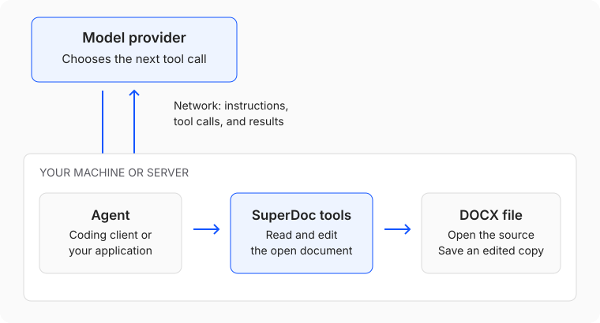

An agent can use SuperDoc to read a Word document and make changes from an instruction. For example, you can ask it to
replace a term in a contract and save the result as a new DOCX.

The model decides what to do. SuperDoc provides the tools that read and change the document. You can connect those tools
to a coding agent you already use, or add them to an agent in your own application.

## How an agent edits a document

A tool is an operation the agent can request, such as opening a file or replacing text. The agent sends arguments to
the tool and receives a result it can use to decide what to do next.

For the contract example:

1. You ask the agent to replace a term and save a copy.
2. The agent uses SuperDoc tools to open the file and find the text.
3. The model chooses an edit. SuperDoc applies it and reports the result.
4. The agent saves the edited DOCX. You open the copy and check the change.

A successful tool call means the operation ran. You still need to check that the edit matches your request.

## Choose where to start

### Use a coding agent you already have

Connect SuperDoc to Claude Code, Claude Desktop, Cursor, or Windsurf through MCP, a protocol that lets an agent call
external tools. The client starts the SuperDoc MCP server on your machine and passes tool calls to it.

Start with [Connect a coding agent](/agents/mcp/connect), then make one edit to a sample document. You do not need to
write an agent loop or choose a model provider in SuperDoc.

### Build an agent into your application

Use `@superdoc/sdk` for Node.js or `superdoc-sdk` for Python. Your application opens the document, sends requests to
your model provider, runs the tools it selects, and decides when to save.

[Build an agent](/agents/build/build-an-agent) introduces the toolkit and a document-editing loop. This path gives you
control over the model, instructions, and application workflow.

If your code already knows the edit to make, you can use the [Node.js SDK](/agents/automation/node-sdk),
[Python SDK](/agents/automation/python-sdk), or [CLI](/agents/automation/cli) directly without a model.

## Where the code runs

The MCP server and these SDKs run in a local or server process. They edit the document without mounting the Editor UI.
Your agent or application sends the model its instructions and tool results, which can contain document text.

The SuperDoc Editor runs in the browser. Use it when a person needs to see or review the document. In a web application,
keep the Node.js SDK on your server and call it through your application endpoints; use the Editor in the browser.
Do not import the browser `superdoc` package into a Node.js API route to run these workflows.

For the complete engine and package map, see [How SuperDoc works](/resources/how-superdoc-works).

## Start with one document

[Connect a coding agent over MCP](/agents/mcp/connect) to open a sample, make a tracked edit, and inspect the saved copy.
If you are building your own agent, begin with [Build an agent](/agents/build/build-an-agent).
